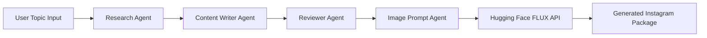

# Instagram Content Creation (Multi-Agent System)

An autonomous AI-powered Instagram content pipeline built with CrewAI that researches topics, writes engaging captions, reviews content quality, generates cinematic image prompts, and creates visuals using FLUX image generation models.

## Architecture



## Tech Stack

- Python 3.13.5
- CrewAI
- LangChain
- GitHub Models API
- Hugging Face Inference API
- FLUX.1-schnell
- python-dotenv
- Pillow

## Why a Multi-Agent Architecture?

Separating responsibilities across specialized agents produces a more robust, maintainable, and higher-quality content pipeline compared to a single monolithic LLM call.

Benefits:
- Better content quality through specialization
- Modular design and easier debugging
- Improved prompt engineering and reuse
- Scalable workflow automation

## Internal Workflow

1. User provides a topic.
2. Research Agent gathers trends, references, and supporting ideas.
3. Writer Agent drafts short and long captions and suggested hooks.
4. Reviewer Agent refines tone, grammar, and hashtag strategy.
5. Image Prompt Agent crafts cinematic, model-ready prompts.
6. Hugging Face FLUX model (e.g. `FLUX.1-schnell`) generates visuals.
7. Final assets (captions, hashtags, and images) are saved to `outputs/`.

## Getting Started

1. Create a Python 3.10+ virtual environment.
2. Copy your secrets into a `.env` file (API keys for GitHub Models, Hugging Face, etc.).
3. Install dependencies:

```bash
pip install -r requirements.txt
```

4. Run the pipeline:

```bash
python main.py --topic "Your topic here"
```

## Future Improvements

- Instagram Reel script generation
- Auto-posting using the Instagram Graph API
- Multi-language caption support
- Memory-enabled agents for context retention
- Trend scraping from social platforms
- Agent performance evaluation metrics

## Learning Outcomes

- Multi-Agent AI orchestration patterns
- LLM workflow automation and prompt engineering
- API integration with Hugging Face and GitHub Models
- End-to-end generation of captions and visuals

## License

This project is released under the MIT License.


If you'd like, I can also:
- add a `.env.example` template and a minimal `main.py` runner,
- scaffold agent stubs under `agents/`, or
- wire up a sample Hugging Face call using `FLUX.1-schnell`.


## System Workflow & Agents

A 4-agent team works in sequence to produce a complete Instagram-ready package:

1. **Research Agent** – Gathers facts, trends, and key points on a given topic (e.g., "Digital Nomad Lifestyle").
2. **Content Writer Agent** – Drafts a compelling Instagram caption (both a short-form and long-form version), including emojis and a strong Call-To-Action (CTA).
3. **Reviewer Agent** – Edits the drafted content to ensure clarity, grammar, proper tone, and strong hashtag usage.
4. **Image Prompt Generator Agent** – Creates detailed, high-quality text-to-image prompts based on the finalized content.

The system then uses the generated prompts (or topic-based prompts) to call the Hugging Face inference API, saving the final visuals to disk.

## Technical Requirements & Setup

### Prerequisites
- Python 3.10+
- GitHub Models API Key (for LLM inference via GitHub Models)
- Hugging Face Access Token (for image generation)

### Installation

1. Create a virtual environment and activate it:
   ```bash
   python3 -m venv venv
   source venv/bin/activate  # On Windows, use `venv\Scripts\activate`
   ```

2. Install dependencies:
   ```bash
   pip install -r requirements.txt
   ```

3. Environment Variables:
   
   Add your keys in `.env`:
   ```
   OPENAI_API_KEY=your_github_models_api_key_here
   HF_TOKEN=your_hugging_face_token_here
   ```


### Outputs
Upon successful execution, the script will:
- Output the **Final Instagram Package** (short caption, long caption, and finalized hashtags) as reviewed and finalized by the Reviewer Agent.
- Generate and save `output_image_1.jpg` and `output_image_2.jpg` to the project directory using the Image Generation API.

#### Short-Form Caption
🌍✨ Dreaming of swapping your office desk for a beachside hammock or a cozy cafe in Tbilisi? The digital nomad lifestyle isn’t just a dream anymore—it’s YOUR reality waiting to happen! 🌴💻

With "work from anywhere" policies, affordable destinations, and worldwide digital nomad visas, life’s big adventure is calling. Don’t wait—live it NOW! 💼✈️

Drop a 🌎 if you’re ready to pack your bags and embrace freedom like never before!

👉 #DigitalNomadDreams #RemoteWorkLife #WorkFromAnywhere

#### Long-Form Caption
🚀✈️ *What if your office could be... anywhere you want it to be?*

The world of work has changed forever, and it’s all about FREEDOM. 🌏💻 With companies like Airbnb, Spotify, and Twitter letting employees "work from anywhere," it’s your chance to design a life that feels more like an adventure than a routine.

And here’s the exciting part: Over 50 countries around the globe now offer **digital nomad visas**, opening doors for remote professionals like YOU. ✨ Imagine having the flexibility to work while exploring new cultures and ticking off bucket-list destinations. Whether it's sipping wine in Portugal 🇵🇹 with their popular D7 visa or soaking up Medellin’s vibrant culture 🇨🇴, the possibilities are endless. Affordable, emerging hubs like Tbilisi 🇬🇪, Cape Town 🇿🇦, and Bangkok 🇹🇭 are waiting to welcome you!

But it’s not just about *where* you work—it’s about *how* you live. With co-living and co-working spaces booming, your work-life balance just got an upgrade. Picture networking over coffee, yoga retreats, and finding eco-friendly stays to travel more sustainably. It’s about designing a lifestyle that connects you to new people, new opportunities, and, most importantly, yourself.

So, why wait? Ready to ditch the daily commute and embrace this freedom-filled, nomadic life? 🌍 YOU are the architect of your story.

👇 Tell us: Which dream destination would YOU work from first?

—
🐾 Pro Tip: Stay tuned for upcoming posts filled with tips to snag your first digital nomad visa, find the ultimate co-living spots, and make your transition seamless.

🧳 Let’s pack your bags, wanderlust crew!

👉 #DigitalNomadLifestyle #WorkFromAnywhere #RemoteWorkLife #LaptopLifestyle #TravelAndWork #WanderlustVibes #LifeInTheCloud #NomadicDreams #FreedomToRoam #DigitalNomadAdventures #ExploreMoreLiveMore #WorkAbroadExperience #BucketListLiving

✨ Your dream life = one decision away. Let’s make it happen! 💫


